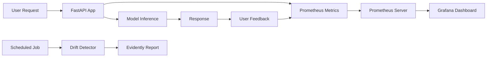

# Comprehensive MLOps Monitoring Setup

This document describes the complete monitoring infrastructure for the recommendation system, covering all metrics categories.

## 📊 Metrics Overview

### 1. **Offline Evaluation Metrics** (Model Quality)

These metrics are computed during model training and evaluation:

| Metric | Description | Current Value | Target |
|--------|-------------|---------------|--------|
| **Precision@10** | Fraction of recommended items that are relevant | 0.2838 | > 0.25 |
| **Recall@10** | Fraction of relevant items that are recommended | 0.3609 | > 0.30 |
| **F1@10** | Harmonic mean of Precision and Recall | 0.2737 | > 0.25 |
| **NDCG@10** | Ranking quality (position-aware) | 0.4637 | > 0.40 |
| **MAP** | Mean Average Precision | 0.3288 | > 0.30 |
| **Hit Rate@10** | % of users with at least 1 relevant item | 0.9452 | > 0.85 |
| **MRR** | Mean Reciprocal Rank | 0.7681 | > 0.65 |

**Tracked in:** MLflow, WandB  
**Location:** `src/evaluation/metrics.py`

---

### 2. **Business Metrics** (User Engagement)

Real-time metrics tracked via Prometheus:

| Metric | Description | Tracking Method |
|--------|-------------|-----------------|
| **CTR** | Click-Through Rate: clicks / impressions | Gauge |
| **Conversion Rate** | Conversions / total recommendations | Gauge |
| **Dwell Time** | Time spent on recommended items | Summary (histogram) |
| **Bounce Rate** | % of users who leave immediately | Gauge |
| **Add-to-Cart Rate** | % of recommendations added to cart | Gauge |

**Tracked in:** Prometheus (via `/feedback` endpoint)  
**Location:** `src/monitoring/prometheus_metrics.py`, `src/serving/app.py`

---

### 3. **System Performance Metrics**

| Metric | Description | Type |
|--------|-------------|------|
| **Inference Latency (p95/p99)** | 95th/99th percentile response time | Histogram |
| **Requests per Second (RPS)** | Throughput of recommendation API | Counter (rate) |
| **Error Rate** | Failed requests / total requests | Counter (rate) |
| **Timeout Rate** | Requests exceeding 500ms | Counter |

**Tracked in:** Prometheus  
**Endpoint:** `http://localhost:8081/metrics`

---

### 4. **Data Quality & Drift Metrics**

Monitored using Evidently AI:

| Metric | Description | Detection Method |
|--------|-------------|------------------|
| **Feature Mean/Std Shift** | Changes in feature distributions | Statistical tests |
| **PSI** (Population Stability Index) | Overall distribution drift | PSI calculation |
| **KS Statistic** | Kolmogorov-Smirnov test for drift | Two-sample KS test |
| **Null/Missing Rate** | % of missing values per feature | Data quality checks |
| **Out-of-Range Values** | Values outside expected bounds | Range validation |

**Tracked in:** Evidently AI Reports  
**Location:** `src/monitoring/drift_detector.py`  
**Reports:** `monitoring/evidently_reports/drift_report.html`

---

## 🛠️ Monitoring Stack

### **MLflow** (Experiment Tracking)
- **Purpose:** Track model training runs, hyperparameters, and offline metrics
- **Integration:** `src/training/trainer.py`
- **Access:** Run `mlflow ui` and visit `http://localhost:5000`

### **Prometheus** (Metrics Collection)
- **Purpose:** Scrape and store time-series metrics from the API
- **Config:** `monitoring/prometheus/prometheus.yml`
- **Metrics Endpoint:** `http://localhost:8081/metrics`
- **Run:** `docker-compose up prometheus`

### **Grafana** (Visualization)
- **Purpose:** Create dashboards for real-time monitoring
- **Dashboard:** `monitoring/grafana/dashboards/recommendation_system.json`
- **Access:** `http://localhost:3000` (default: admin/admin)
- **Run:** `docker-compose up grafana`

### **Evidently AI** (Drift Detection)
- **Purpose:** Monitor data quality and model drift
- **Reports:** HTML reports with interactive visualizations
- **Run:** `uv run python src/monitoring/drift_detector.py`

---

## 🚀 Quick Start

### 1. Start the Monitoring Stack

```bash
# Start Prometheus and Grafana
docker-compose up -d prometheus grafana

# Verify Prometheus is scraping
curl http://localhost:9090/api/v1/targets

# Access Grafana
open http://localhost:3000
```

### 2. Start the Recommendation API

```bash
# Start FastAPI server with Prometheus metrics
uv run uvicorn src.serving.app:app --host 0.0.0.0 --port 8000

# Metrics endpoint
curl http://localhost:8081/metrics
```

### 3. Send Test Requests

```bash
# Get recommendations
curl -X POST http://localhost:8000/recommend \
  -H "Content-Type: application/json" \
  -d '{"user_id": 12345, "n": 10}'

# Send feedback (for business metrics)
curl -X POST http://localhost:8000/feedback \
  -H "Content-Type: application/json" \
  -d '{"event_type": "click", "user_id": 12345, "item_id": 67890}'
```

### 4. Generate Drift Reports

```bash
# Run drift detection
uv run python src/monitoring/drift_detector.py

# View report
open monitoring/evidently_reports/drift_report.html
```

---

## 📈 Grafana Dashboard Panels

The dashboard (`recommendation_system.json`) includes:

### **System Performance**
- Request Rate (RPS)
- Latency (p95/p99)
- Error & Timeout Rate

### **Business Metrics**
- CTR, Conversion Rate, Add-to-Cart Rate, Bounce Rate (gauges)
- User Actions Over Time (clicks, impressions, conversions)
- Dwell Time Distribution

### **Model Quality**
- Precision@10, Recall@10, F1@10
- NDCG@10, MAP, MRR

---

## 🔍 Prometheus Queries

### System Metrics
```promql
# Request rate (last 5 minutes)
rate(rec_request_count_total[5m])

# p95 latency
histogram_quantile(0.95, rate(rec_latency_seconds_bucket[5m]))

# Error rate
rate(rec_error_count_total[5m]) / rate(rec_request_count_total[5m])
```

### Business Metrics
```promql
# CTR
rec_ctr

# Click rate
rate(rec_clicks_total[5m])

# Conversion rate
rate(rec_conversions_total[5m]) / rate(rec_impressions_total[5m])
```

---

## 📝 Logging Metrics

### From Training Pipeline
```python
import mlflow

with mlflow.start_run():
    mlflow.log_params(config)
    mlflow.log_metrics({
        "precision@10": 0.2838,
        "recall@10": 0.3609,
        "ndcg@10": 0.4637
    })
    mlflow.log_artifact("models/als_model.pkl")
```

### From API (Prometheus)
```python
from src.monitoring.prometheus_metrics import (
    track_request, record_latency, record_feedback
)

# Track request
track_request()
record_latency(duration)

# Track business event
record_feedback("click")
record_feedback("conversion")
record_feedback("dwell_time", value=45.2)
```

---

## 🎯 Alerting Rules (Prometheus)

Create `monitoring/prometheus/alerts.yml`:

```yaml
groups:
  - name: recommendation_system
    rules:
      - alert: HighLatency
        expr: histogram_quantile(0.95, rate(rec_latency_seconds_bucket[5m])) > 0.5
        for: 5m
        annotations:
          summary: "High p95 latency detected"
      
      - alert: HighErrorRate
        expr: rate(rec_error_count_total[5m]) / rate(rec_request_count_total[5m]) > 0.05
        for: 5m
        annotations:
          summary: "Error rate above 5%"
      
      - alert: LowCTR
        expr: rec_ctr < 0.05
        for: 10m
        annotations:
          summary: "CTR dropped below 5%"
```

---

## 📊 Evidently Drift Report Contents

The HTML report includes:

1. **Data Drift Summary**
   - Number of drifted columns
   - Drift detection method (KS test, PSI)
   - Drift score per feature

2. **Data Quality**
   - Missing values count
   - Feature statistics (mean, std, min, max)
   - Correlation changes

3. **Feature-Level Analysis**
   - Distribution plots (reference vs current)
   - Statistical test results
   - Drift scores

---

## 🔄 Continuous Monitoring Workflow



---

## 📦 Dependencies

All monitoring tools are included in `pyproject.toml`:

```toml
[project]
dependencies = [
    "mlflow>=2.9.0",
    "prometheus-client>=0.19.0",
    "evidently>=0.7.0",
    "wandb>=0.16.0",
]
```

---

## 🎓 Best Practices

1. **Set up alerts** for critical metrics (latency, error rate, CTR)
2. **Run drift detection** daily or weekly
3. **Review Grafana dashboards** regularly
4. **Track model versions** in MLflow
5. **A/B test** new models before full deployment
6. **Monitor business impact** alongside technical metrics

---

## 📚 References

- [Prometheus Documentation](https://prometheus.io/docs/)
- [Grafana Dashboards](https://grafana.com/docs/grafana/latest/dashboards/)
- [Evidently AI](https://docs.evidentlyai.com/)
- [MLflow Tracking](https://mlflow.org/docs/latest/tracking.html)
